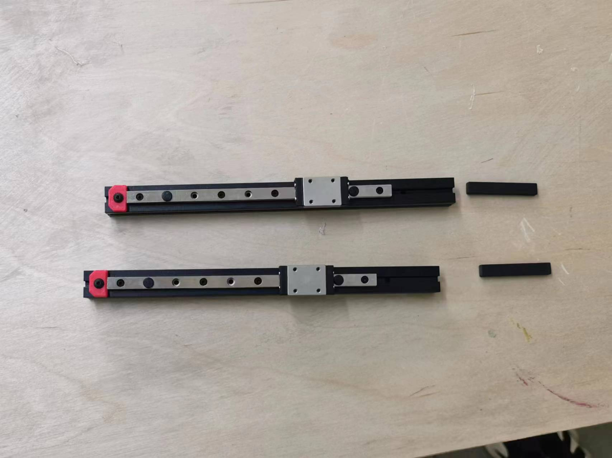

+++
title = 'construction part'
date = 2024-04-21T14:26:10+08:00
weight = 3
+++
## **Day one**
From today, I will end preparing and start building my printer! Today, I finished attathing the MGN7 Rails to the E extrusions. Be aware not to let the carriages slide out of the rails. It will be horrible. Beilieve me. Also, when attatching and slding the nut bars into the extrusions, remember to take a look at the CADs in the pacakage you downloaded before, it might save you some time! Be aware of the nuts are need to be put but aren't said in the manual. Those that are very obvious will not be said, so use your brain while making this!

## **Day one**