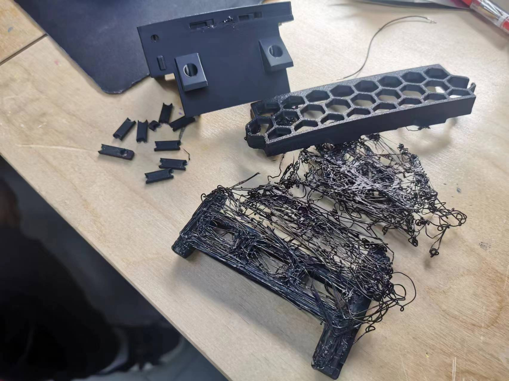

+++
title = 'preparation part'
date = 2024-04-21T14:26:10+08:00
weight = 1
+++

## **Buying parts on the internet**  
I went on the official website of Voron and selected the Voron 0.2. Click “configurator” and you get the BOM list of the parts you need to buy.

[BOM link](voron0.2_bom.xlsx)  

## **Github!**
I went on to the Github website and searched for Voron0.2. I downloaded the entire file and found the manual, the STLs for the printed parts, the CADs, the configurators and so on. The STLs are especially important because they have all of the printed parts that we need and we can directly use them without changing almost anything. I chose the parts that I needed, which isn't every thing by the way, and started to print the parts.
## **Preparing for and printing the printed parts**

After buying all of the parts needed, I started to typeset the printed parts according to the manual. I used BambuStudio as my slicing software and printed on Bambu Lab P1S and X1C printers. After a comparation between PLA, PETG and ABS, I found ABS as the best material which is also the only material that can meet our needs. It is better and **enduring high temperatures** and has a **better mechanical behaviour**.

   

After finishing with the parameters of the printers, I started to print them. There were some failures because of a too-fast printing speed, and I had to reprint them at a speed of 50%.

