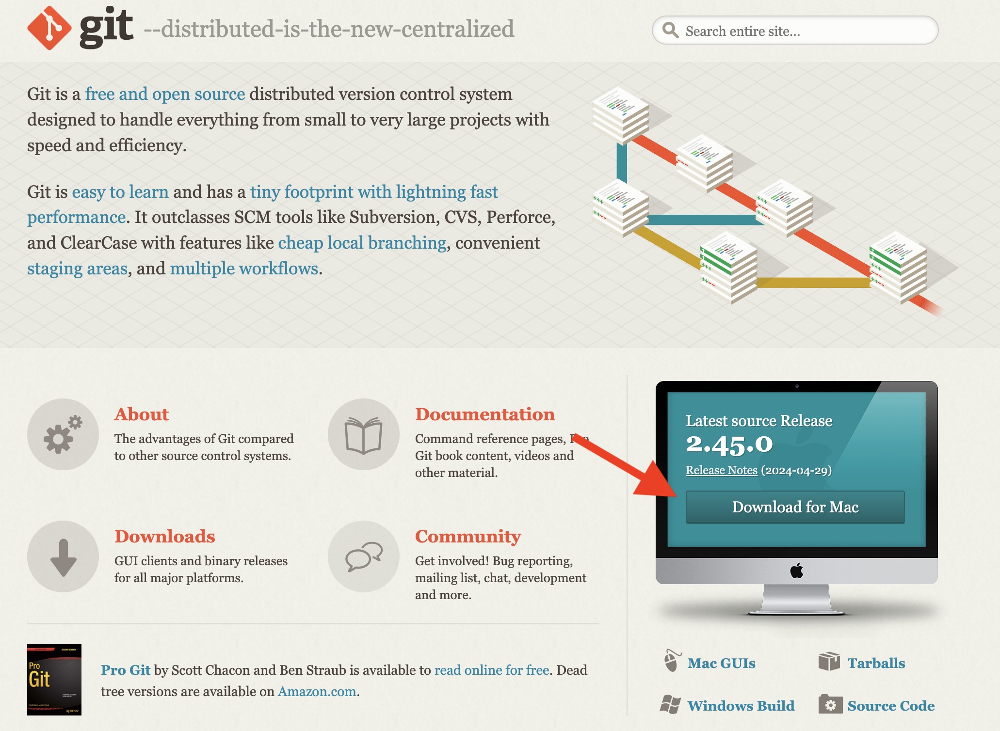
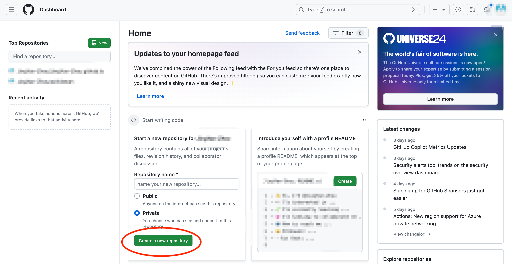
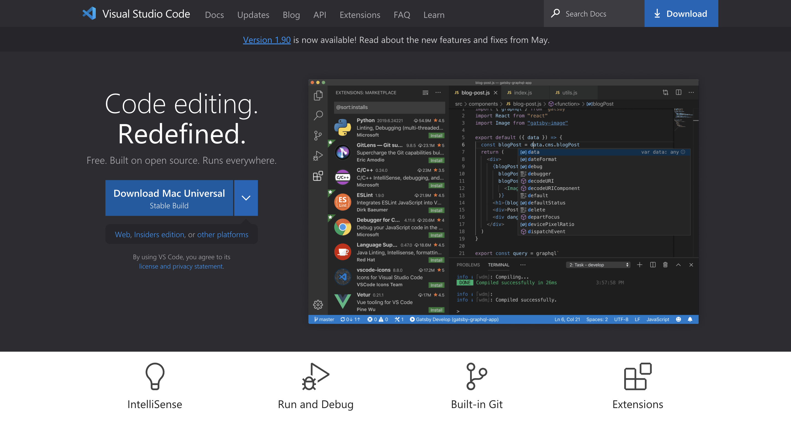

+++
title = 'software part'
date = 2024-04-21T14:26:10+08:00
weight = 2
+++

## **Installing Git**  
 Git is a terminal programme that is used to record the past steps and editions of my programme that will be used later to generate the webpage of mine. First, I went on the [official website](https://git-scm.com/) and clicked "download". I use a Mac so it is Download for Mac, the homepage will change the version according to your computer automatically. If not, choose yours by clicking the blue words below the "download for mac/windows". After coming in, I chose Binary Installer to install because it is better for my computer, note that it varies between different types of computers. By the way, Binary Installer is a older version, but it is good enough for me to use.
 
 ## **Creating my own library**
 First, I went on the [official website](https://github.com/) of Github. Then, I signed up my own account. After signing in, I made a new repository. After that, I decided to add a SSH key to my acount for security. I entered my account profile page and clicked "settings". Then, I clicked SSH and GPG keys on the left. Then I added my own key.
  
<video id="video" width="640" height="360" controls poster="0">
      <source id="mp4" src="../docs/pictures/SSH key.mp4" type="video/mp4">
</video>
 ## **Creating my own website**
 In order to remember and record what I have done, I decide to make my own website which is what you are reading right now. First, I downloaded VS Code in order to write down words. I am using markdown due to it is easier and more convenient to write with. The picture of the download page is down there⬇️.
 
After that, I went on to the official website of Hugo and followed the instructions of the quickstart manual and created my own website!